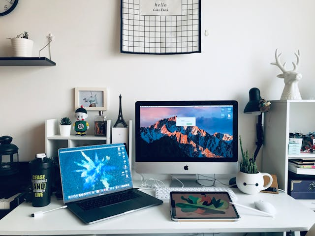

# Blog Unir


## Descripción

**Blog Unir** es un proyecto web que presenta artículos sobre tecnología, gadgets, innovación y ciberseguridad. Este proyecto fue desarrollado utilizando **HTML** y **CSS**, con un diseño responsivo y una estructura fácil de navegar.

## Funcionalidades

- 🌟 **Diseño responsivo:** Optimizado para diferentes tamaños de pantalla.
- 🖼️ **Contenido visual:** Uso de imágenes para enriquecer los artículos.
- 🧭 **Navegación fácil:** Menú interactivo y flecha de retroceso.
- 🔗 **Enlace a GitHub:** Incluye acceso al perfil del creador.

## Capturas de Pantalla

### Vista Principal


### Ejemplo de Artículo


## Estructura del Proyecto
blogUnir/
├── index.html         # Página principal
├── articulo1.html     # Artículo 1
├── articulo2.html     # Artículo 2
├── articulo3.html     # Artículo 3
├── styles.css         # Estilos CSS
├── images/            # Carpeta de imágenes
└── README.md          # Archivo de documentación

## Tecnologías Utilizadas

- **HTML5**: Estructura del contenido.
- **CSS3**: Estilos y diseño.
- **Git y GitHub**: Control de versiones y colaboración.

## Cómo Visualizar el Proyecto

1. Clona este repositorio:
   ```bash
   git clone https://github.com/MichellePerezS/blogUnir.git